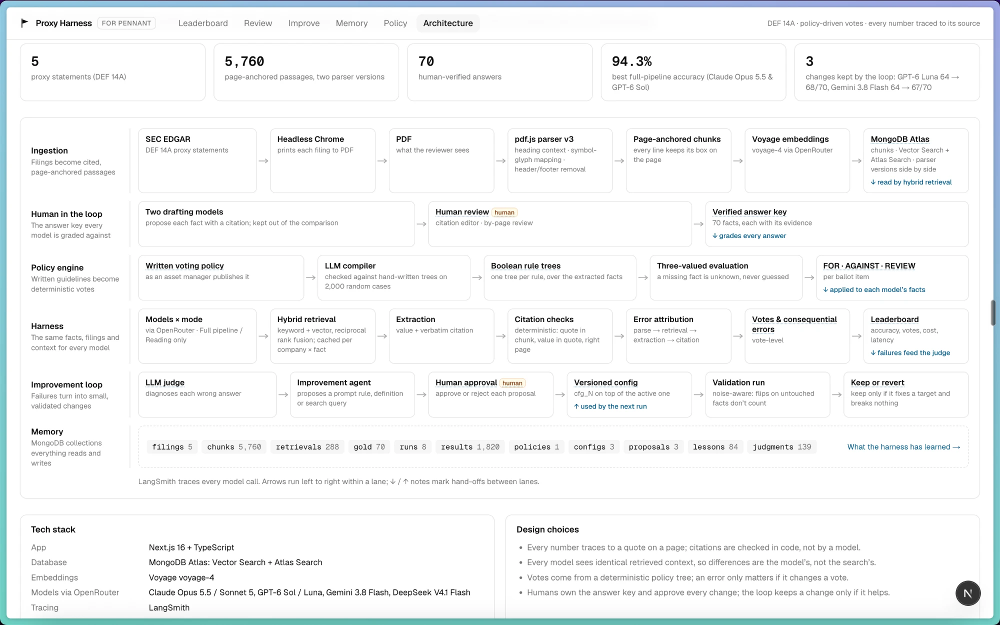
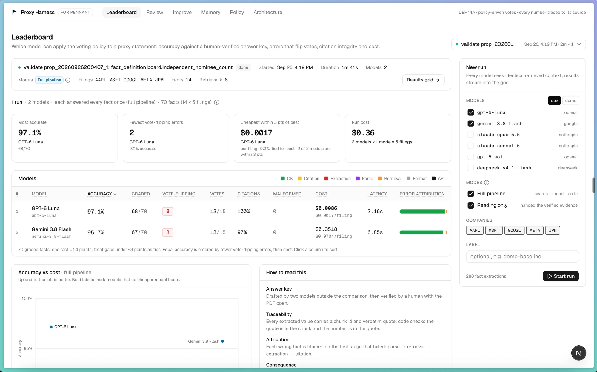
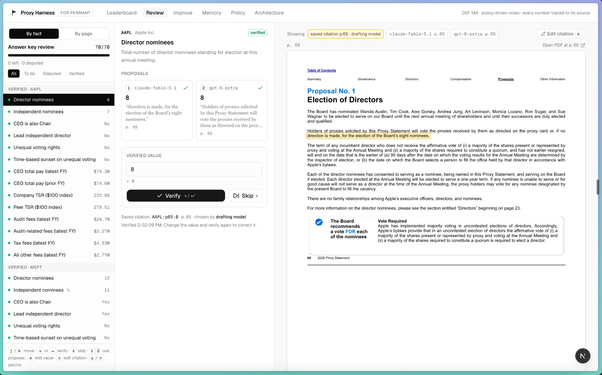
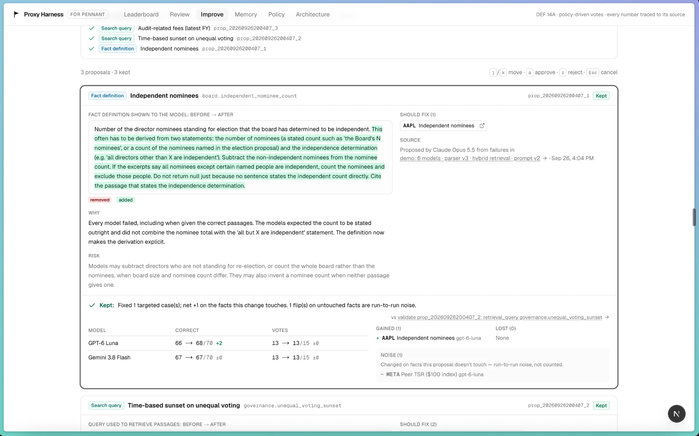
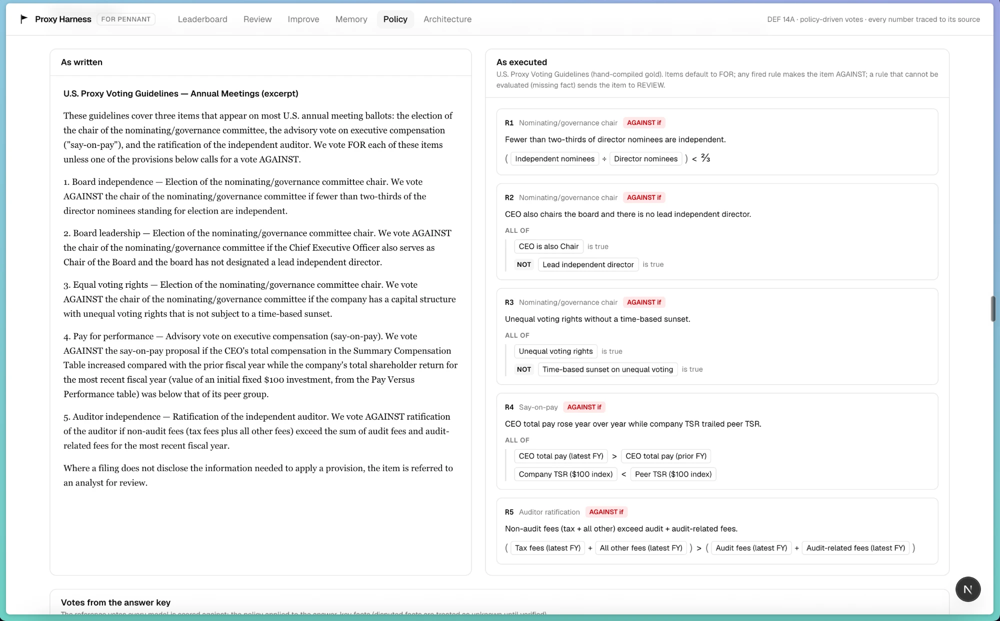

# Proxy Harness

An evaluation harness for applying an institutional investor's **proxy-voting policy** to company **proxy statements (SEC DEF 14A)** with LLMs, built so that every number traces back to the exact place in the PDF it came from, and every wrong vote can be traced to the step that caused it.

Built at the MongoDB "Harness Engineering & Model Wrangling" hackathon (NYC, Sept 2026), for [Pennant](https://www.ycombinator.com/companies/pennant) (corporate-governance software, YC S26).

## Demo

[](https://youtu.be/4ckXIIlr7Rw)

**▶ [Watch the 1-minute demo on YouTube](https://youtu.be/4ckXIIlr7Rw)**

| Architecture | Leaderboard |
|---|---|
| [](docs/media/architecture.webp) | [](docs/media/leaderboard.webp) |
| **Answer-key review** (source highlights, citation editor, by-page review) | **Improve** (agent proposals, human approval, validation verdicts) |
| [](docs/media/review.webp) | [](docs/media/improve.webp) |
| **Policy** (as written vs. as executed) | |
| [](docs/media/policy.webp) | |

**Pages:** Leaderboard (model comparison, sortable, ties explicit) · Run (live results grid, and a **Votes** tab that explains every vote) · Review (answer key) · Improve (human-approved changes) · Memory (everything the harness learned, in MongoDB) · Policy · Architecture.

## How it works

```
EDGAR DEF 14A ──► PDF ──► page-anchored chunks ──► Voyage embeddings ──► MongoDB Atlas Vector Search
                          (every line keeps its bbox)                           │
voting policy text ──► boolean expression tree (per ballot item)                │ top-k per fact
                                   │                                            ▼
                                   │                 extraction model (any OpenRouter model)
                                   │                 → { value, chunk_id, verbatim quote, fiscal_year }
                                   │                                            │
                                   │                 deterministic checks: quote ∈ chunk? value ∈ quote?
                                   ▼                                            ▼
                     votes computed in code  ◄──────────────  facts
```

- **The model never casts the vote.** It only extracts the facts the policy needs. The policy is compiled into expression trees, and code evaluates them with three-valued logic, so a missing fact yields REVIEW instead of a guess.
- **Citations are checked without a model.** Every answer must cite one chunk and quote it verbatim. Code verifies that the quote is actually in that chunk and that the value is actually in the quote (allowing for tables stated in thousands or millions). The UI highlights the exact lines on the PDF page.
- **Errors are attributed to the first stage that failed**, using the human-verified answer key:

  | stage | meaning |
  |---|---|
  | `parse` | the correct evidence isn't in any parsed chunk (the parser lost it) |
  | `retrieval` | the evidence exists but wasn't in the chunks given to the model |
  | `extraction` | the evidence was in context and the model read it wrong (wrong period, row or units) |
  | `citation` | the value is right but the quote doesn't support it |
  | `format` / `api` | malformed output after one repair retry / provider error |

- **Consequential errors.** A wrong fact counts as consequential only if substituting the correct value changes a vote. The headline metric is consequential errors, not raw accuracy.
- **Fair model comparison.** Retrieval is cached per company × fact, so every model sees identical context. **Reading-only** mode (called `oracle` in code) hands each model the human-verified evidence passage directly, and the gap to the **full pipeline** is retrieval's share of the error.
- **Answer key.** Two strong models that are *not* in the comparison draft answers (agreements are marked `proposed`, disagreements `disputed`), and a human verifies every one in `/review` against the highlighted source. The key is exported to `data/gold/gold.json` so it outlives the database.

## Casebook: a regression set of real traps

`pnpm casebook` builds `data/casebook.json` from the verified key and every graded run: 28 cases, each with the expected value, the evidence passage, a trap type and what every model did. `pnpm casebook --check <runId>` scores any run against it without calling a model.

| trap | example |
|---|---|
| wrong table | JPMorgan: $43.0M in its own pay table vs. $40,632,724 in the SEC Summary Compensation Table |
| wrong column | Meta: company TSR 243.32 sits next to peer TSR 445.33 |
| two passages | Apple: 7 independent nominees = "eight nominees" (p. 65) minus Mr. Cook (p. 18); failed 15 of 16 times |
| absence | No sunset provision; JPMorgan has no "All other fees" row (rows sum to the total) |
| definition | An independent Chair is not a lead independent director |
| glyph | Meta's independence checkmarks were a Wingdings code point until mapped to ✓ |
| retrieval | JPMorgan's fee descriptions outrank its fee table; table titles split from their rows |

## Self-improvement loop: built, measured, not adopted

The manual loop (attribute → root-cause → fix → re-measure) moved retrieval recall by about 15 points. We also built the automated version: `pnpm learn:retrieval`.

1. **Learn:** from the verified evidence of 4 companies, find terms the fact's search query lacks. Terms must appear in at least 2 companies' evidence and are weighted by rarity.
2. **Store:** save them as lessons in MongoDB, with provenance: which companies taught them and which misses motivated them.
3. **Apply and measure:** search the held-out 5th company with query + lessons. Rotate so every fact is tested once on a filing its lessons never saw.

| recall@8, leave one company out (70 facts) | result |
|---|---|
| no lessons | 57/70 (81.4%) |
| every lesson (naive) | 56/70 (80.0%): fixed JPMorgan's fee-table retrieval, broke three independence counts |
| gated ("adopt only if it loses no training case") | 57/70 (81.4%): +4 / −4 |

**Decision: not adopted.** Keyword lessons learned from five filings fix one company's quirk and break another's. The gate didn't help, because the harm only shows up on unseen filings. The machinery is in place (lessons with provenance, a gate, held-out evaluation) for a better learning signal: structure-aware lessons such as "search the table *under* this heading", or LLM-proposed query rewrites validated the same way on more filings.

## LLM judge and a human-approved improvement loop

**Judge** (`pnpm judge`). An LLM audits each answer against the passages the model saw, with no answer key, so it also works on new filings. Its verdicts are correct, incorrect, missed (derivable but not given) or not in context. Scored against the verified key on 139 answers from GPT-6 Sol and GPT-6 Luna, judged by DeepSeek V4.1 Flash for $0.07:
- **No false alarms** on the 129 correct answers.
- **All 10 errors diagnosed as "not in the context the model saw"**, which independently confirms that the misses come from search and the spec, not from reading. Examples: "states all directors other than Mr. Cook are independent but does not give the number of nominees"; "describes what audit-related fees comprise but never states the amount".

**Improvement agent → human approval → validation** (`pnpm improve propose|list|approve|reject`, and the `/improve` page).
1. **Propose.** An agent (Claude Opus 5.5) reads graded failures, judge diagnoses and casebook notes. It proposes at most 3 changes: a prompt rule, a clearer fact definition, or a better search query. Each comes with the cases it should fix and its risk, and must not mention any company-specific fact.
2. **Approve.** A human approves or rejects each proposal. Approval creates a new versioned config in MongoDB on top of the active one.
3. **Validate.** A validation run (2 cheap models, about $0.05) compares against the run the proposal came from. The change is **kept** only if it fixes a case it targeted, doesn't break the facts it touches, and loses no votes. Otherwise it is **reverted**.
4. **Noise-aware.** A search-query or definition change can only affect its own fact. Flips elsewhere are reported as run-to-run noise and excluded from the verdict. The rehearsal showed GPT-6 Luna flipping two untouched Meta TSR facts between otherwise identical runs, even at temperature 0.

**The first round, with three proposals, all approved by a human and all kept.** Each change is measured against the validation run of the configuration it was built on, so each report isolates one change:

| # | change (kind → fact) | measured effect | noise |
|---|---|---|---|
| 1 | fee-table row wording in the audit-related fees query | +2: JPMorgan fixed for both models | 1 flip on an untouched fact |
| 2 | share-class wording in the sunset query | +4: Apple and JPMorgan fixed for both models, nothing broken | none |
| 3 | derive independent-nominee counts from two statements | +1: Apple fixed for GPT-6 Luna (Gemini still misses it) | 1 flip |

**Cumulative, full pipeline:** GPT-6 Luna went from **91.4% to 97.1%** (64 → 68/70) and Gemini 3.8 Flash from **91.4% to 95.7%** (64 → 67/70). The full six-model run with the improved config is in the results table below: every model improved. Votes are unchanged at 13/15: JPMorgan's auditor vote still needs "all other fees", and Gemini still misses Apple's count. Those are the targets for the next round.

**A repeat run with all three changes** (fresh sample, same config): both models scored **95.7% (67/70)**. GPT-6 Luna scored 68/70 in validation and 67/70 here with the same config; the one-fact gap is run-to-run noise.

**How it was wrong, how we found out.** In the repeat run, change 3 (derive independent-nominee counts) made GPT-6 Luna answer Apple's independent-nominee count as **2**; the correct value is 7, and it had answered 7 in validation. It cited the right sentence ("all Board members, other than Mr. Cook, are independent") and did the arithmetic wrong. Rule R1 then fired (2/8 < ⅔), so **Apple's nominating/governance vote came out AGAINST instead of FOR**: the first silently wrong vote in the project. Until then every mismatch had been an escalation to REVIEW. The validation run had missed it: that run answered 7, and the vote stayed REVIEW because another fact was missing. The "votes correct" count hid it too (13/15 either way). **What changes:**
- Report *wrong* votes (a flipped FOR/AGAINST) separately from *escalated* votes (REVIEW).
- Never keep a change that creates a wrong vote.
- Validate twice any change that turns abstentions into answers.
- Make derived values cite both passages ("eight nominees" + "other than Mr. Cook"), so code can check the arithmetic.

The free retrieval preview predicted that proposal 2 would push Microsoft's evidence out of the top 8. The validation run showed no loss, because the models still answered Microsoft correctly from other passages. The preview is a cheap signal; the validation run decides.

## Next steps

- **Is the item on the ballot?** Meta holds say-on-pay every three years and has none on its 2026 ballot, yet the policy currently produces a say-on-pay vote for every company. A per-item "on the ballot" fact would yield "not on ballot".
- **Multiple evidence passages per answer.** Derived values need more than one span, e.g. "12 nominees" plus "all but the CEO are independent", or JPMorgan's $0 other fees proven by rows that sum to the total. The answer key and reading-only mode should accept several passages.
- **Images.** Only the text layer is read today. Vision-model captions stored as page-anchored "image" chunks would make charts and infographics searchable, and tables published as images need a vision fallback.
- **Table serialization.** Column-aligned Markdown tables with explicit empty cells, measured as a controlled experiment on extraction-stage errors (so far there has been only one).
- **Jev as a classifier.** TypeSafe's Jev (via OpenRouter) for cheap, calibrated yes/no checks such as "does this passage state that the CEO chairs the board?", scored against the human-verified key.
- **Keyword-search regression.** On JPMorgan, keyword search ranks fee *descriptions* above the fee *table*. Field boosts or table-aware scoring should fix it.

## Stack

TypeScript end to end: Next.js 16, MongoDB Atlas (documents, chunks, vectors, runs, results, answer key), Voyage `voyage-4` embeddings and all models via OpenRouter, pdf.js for parsing (the same version react-pdf uses to render, so boxes line up), LangSmith tracing, and vitest for the deterministic parts.

## Run it

```bash
cp .env.example .env        # OPENROUTER_API_KEY, MONGODB_URI, SEC_USER_AGENT (+ optional LangSmith)
pnpm install
pnpm pipeline               # fetch filings → parse + embed + index → draft answer key
pnpm dev                    # verify answers at /review, then start runs from the leaderboard
pnpm harness --profile dev  # or run comparisons from the CLI (--profile demo, --models a,b, --modes e2e,oracle = full pipeline, reading only)
pnpm test                   # policy engine tests
pnpm judge                  # LLM judge on a run's answers, scored against the answer key
pnpm improve propose        # improvement agent proposes changes (then approve on /improve or `pnpm improve approve <id>`)
pnpm harness --profile dev --config active   # run with every approved change
pnpm casebook               # rebuild the regression casebook; `pnpm casebook --check <runId>` scores a run
pnpm learn:retrieval        # automated retrieval lessons, evaluated leave-one-company-out
pnpm regrade --all          # re-grade stored answers against the current answer key (no model calls)
```

Model line-ups live in `src/lib/config.ts` (`dev` = 2 cheap models, `demo` = 6 across Anthropic, OpenAI, Google and DeepSeek). Runs always pin exact model IDs, with no routers or "latest" aliases, so every result is attributable to one model.

## Results

All numbers are graded against the **fully human-verified answer key** (70 facts: 5 filings × 14 facts). Re-grading never re-calls a model.

### Six models, before and after the approved changes (parser v3, hybrid retrieval, prompt v2)

Each model answered every fact twice. **Full pipeline**: it sees the passages our search retrieved. **Reading only**: it is handed the human-verified evidence passage, so any error is about reading, not search. **Before** is the base configuration; **after** is `cfg_3`, the three human-approved changes from the improvement loop. Both runs used the same filings, answer key and grading.

| model | full pipeline: before → after | reading only (after) | wrong votes (after) | escalated to REVIEW | cost per 5 filings |
|---|---|---|---|---|---|
| Claude Opus 5.5 | 94.3% → **97.1%** | 98.6% | **0** | 2 | $1.25 |
| GPT-6 Sol | 94.3% → **97.1%** | 98.6% | **0** | 2 | $0.51 |
| Claude Sonnet 5 | 92.9% → **97.1%** | 98.6% | **0** | 2 | $0.62 |
| Gemini 3.8 Flash | 91.4% → **95.7%** | 98.6% | **0** | 2 | $0.35 |
| DeepSeek V4.1 Flash | 92.9% → **94.3%** | 98.6% | **0** | 2 | **$0.068** |
| GPT-6 Luna | 91.4% → **94.3%** | 97.1% | **0** | 2 | **$0.008** |

- **Every model improved, and no model cast a wrong vote.** Every mismatch is an escalation to REVIEW, and it's the same two for everyone. Apple's nominating/governance chair needs the independent-nominee count, which every model left as "not found". JPMorgan's auditor ratification needs "all other fees", which search still doesn't retrieve.
- **Given the right passage, every model reads it correctly.** The one reading-only error all six share is the fact that needs two passages (below). The only genuine misread is the cheapest model, Luna, reading Meta's company TSR as the peer TSR (the wrong-column trap). It didn't change a vote.
- **Search improvements carried over to every model.** The two approved search-query changes were learned from two cheap models' failures, and they lifted the frontier models too.
- **Decision-grade cost.** GPT-6 Luna is within three facts of the best at under a cent per five filings. Claude Opus 5.5, Claude Sonnet 5 and GPT-6 Sol tie at 97.1%, and Sol costs 40% of Opus.
- **Reliability is part of the cost.** DeepSeek V4.1 Flash returned 3 unparseable answers in the after run: once it wrote its reasoning instead of JSON, and twice it returned nothing.
- **Caveat:** 70 facts is small. One fact moves accuracy by 1.4 points, and GPT-6 Luna varied by ±1 fact between identical runs, so treat gaps under about 3 points as ties.

**A fact that needs two passages.** Apple's independent-nominee count is 7: "the Board's eight nominees" is on p. 65, and "all Board members, other than Mr. Cook, are independent" is on p. 18. Reading-only mode hands over one passage, so all six models correctly refuse to guess. Even with approved change 3 ("derive the count"), models almost always abstain; GPT-6 Luna derived it twice across runs, once correctly (7) and once as **2**, which produced the project's only wrong vote. This is the case for multi-passage evidence (see Next steps), and why change 3 should be reverted until the derivation must cite both passages.

**Reference votes from the answer key:** Alphabet and Meta get AGAINST on the nominating/governance chair (R3: unequal voting rights with no sunset), and Microsoft gets AGAINST on say-on-pay (R4: CEO pay rose from $79.1M to $96.5M while TSR of 255 trailed the peer group's 276). Everything else is FOR.

### What was wrong, how we found it, what we changed

**1. The harness said retrieval, not reading, was the problem.** The first dev run (GPT-6 Luna on 5 filings × 14 facts) got 73% of facts right. Error attribution put **18 of its 19 wrong facts in `retrieval`**: the model never saw the evidence. Only one was a misread. The obvious move would have been to tweak the prompt or reformat tables; the attribution said otherwise.

**2. Root cause: a table's title lands in a different chunk from its numbers.** In JPMorgan's proxy, chunk `p76:0` holds the heading "I. Summary compensation table (SCT)" and chunk `p76:1` holds the rows. Search found the heading and missed the table. The same pattern hid the pay-versus-performance TSR table at four of the five companies.

**3. Fix (parser v3): each chunk carries the heading lines that precede it.** The heading is embedded with the chunk and shown to the model as context, but never counted as a quotable part of the chunk. Parser versions live side by side in MongoDB, so the before/after changes nothing but the parser.

| retrieval recall@8 (68 facts, measured before the final review) | vector only | hybrid (Atlas Search + Vector Search, RRF) |
|---|---|---|
| parser v2 | 67.6% | 80.9% |
| parser v3 (heading context) | 82.4% | **85.3%** |

Both fixes attack the same root cause, so they overlap. Hybrid search alone recovers 13 points on the old parser but adds only 3 on top of the parser fix.

| end to end, vs. the verified key (same model, prompt and checker) | v2 | v3 |
|---|---|---|
| GPT-6 Luna accuracy | 72.9% | **90.0%** |
| Luna wrong facts behind a wrong vote | 16 | **4** |
| Luna votes matching the key | 9/15 | **13/15** |

(Gemini 3.8 Flash's v3 dev run is excluded: five of its answers were cut off by the output budget, a harness bug fixed before the final run.)

**Harness bugs the dev runs caught before the full comparison:**
- The citation checker rejected numbers written as words ("the Board's eight nominees").
- It failed counts a model derived ("all nominees other than the CEO"), which are now marked *not checkable* rather than wrong.
- Gemini's JSON was truncated because reasoning tokens ate a 1,200-token output budget; the budget is now 4,096 for every model.
- Symbol-font checkmarks (Wingdings `U+F0FC`) hid Meta's "Independent" column from every model.

### Traps worth knowing about in real filings

- **Wrong table.** JPMorgan reports Jamie Dimon's 2025 pay twice. Its own "annual compensation" table says **$43,000,000**; the SEC Summary Compensation Table says **$40,632,724**. Only the second is the regulatory number.
- **Agreement is not correctness.** Both answer-key drafting models agreed JPMorgan's pay facts were "not disclosed". Neither had been shown the right table. A human caught it.
- **Absence is an answer.** No sunset provision, no lead independent director, no "All Other Fees" row: there is nothing to quote. One drafting model returned `null`, the other inferred `false`/`0`. The spec now says how to answer and cite absence. JPMorgan's fee rows sum exactly to the total ($91.0M + $38.1M + $5.9M = $135.0M), which is the proof that the other-fees figure is $0.
